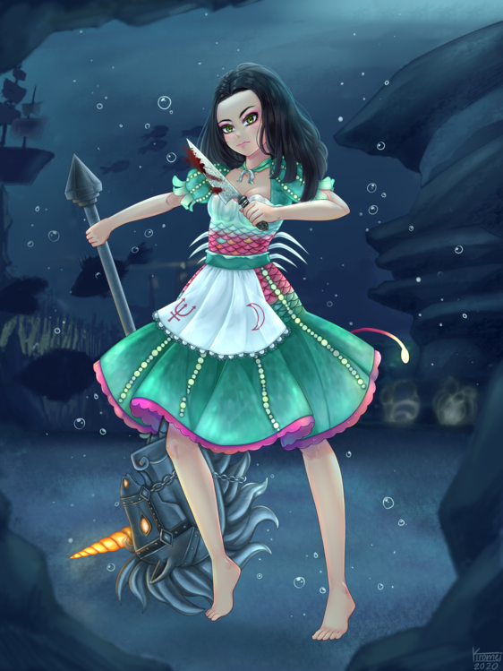
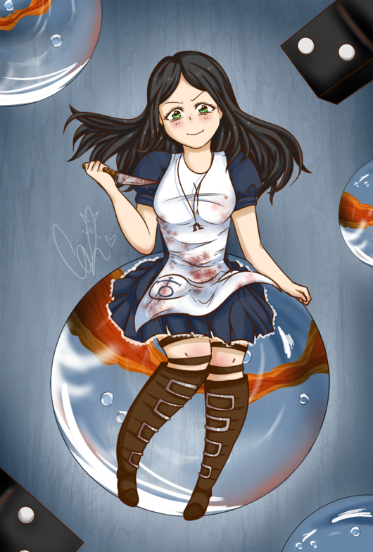
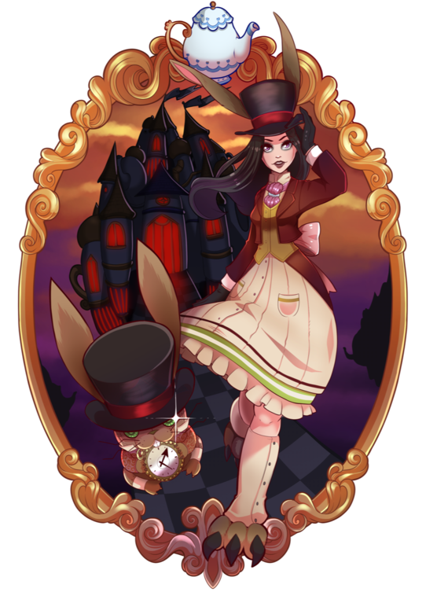

Alice and her Dresses
=====================

[Alice Liddell](https://alice.fandom.com/wiki/Alice_Liddell) wears a different
[dress](https://alice.fandom.com/wiki/Dress) in each part of Wonderland that she
visits, and has some more as DLC. They're all awesome and they're all gorgeous
(well, okay, that might be a matter of opinion - Fleshmaiden says hi), and I've
commissioned a number of artists to create fanart of them. Those artists who
have granted permission for it have their work featured here. There is no
particular order to these and they do not in any way denote a ranking or
prioritization among the dresses, the artists, or anything of the sort. Enjoy
Alice's fashion show, and check out these talented artists!

Siren by Kiromei
----------------

While moving around under water, Alice wears a dress inspired by angler fish
and some other deep-sea creatures. She is seen here, as depicted by [Kiromei](https://www.deviantart.com/kiromei),
carrying a fully-upgraded Hobby Horse and her signature Vorpal Blade, deep
beneath the ocean's surface. Her look of determination leaves us in no doubt
as to the fate of any creature that would dare threaten her world.

Silkmaiden by Heartsome NaNa
----------------------------

The dress from the Mysterious East part of the world, as created by [Heartsome_NaNa](https://heartsomenanaart.weebly.com/).
Alice is carrying her iconic Vorpal Blade and is coming at us boldly across a
parchment of Chinese characters, some of which (火) are aflame. Behind her,
elements of Chinese and Japanese design meet in a conglomeration formed by a
British view of the Orient, influenced more by what looks good on a mantle
than what's actually accurate.

Classic by Cazzie Bliss
-----------------------

Alice's best-recognized Wonderland dress is her classic blue. Any time she
doesn't have a region-specific dress to wear, she'll wear this one, and for
the denoument, there is no dress more appropriate than this one. It's also
the dress she wears in the beautiful Vale of Tears, a place filled with toys
and icons of happiness and fun - including the marble that she's seen riding
on here. She is again holding her iconic Blade, and despite the bloodstains,
she is happy here.

Created by [Cazzie Bliss](https://www.instagram.com/cazzie.bliss/) who streams
on Twitch under [the same name](https://www.twitch.tv/cazzie_bliss).

Late but Lucky by BRBeeps
-------------------------

One of the extra content/DLC dresses, "Late but Lucky" is inspired by Alice's
rabbit friend. She is throwing her rabbit bomb towards us, confident that the
world will warp itself to her needs if she just works her luck suitably. This
dress is elegant and fancy, and one need not be ashamed to be seen in a dress
of this design, no matter how formal the occasion.

This gorgeous piece is the result of the expertise of [BRBeeps](https://www.brbeeps.com).
