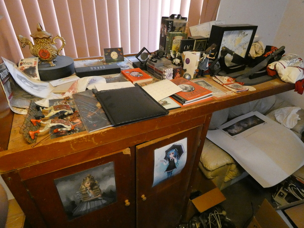

The Alice Shelf
===============

Over the years, I have collected quite a few pieces of Alice in Wonderland
memorabilia. Not all of them are "valuable" in the classic sense, but they
are very precious to me - some because I know the people who created them,
some because they represent some special memories, and most or all of them
because they are absolutely beautiful.

Here are a few photos to give you a bit of an idea of what's on the Shelf:

